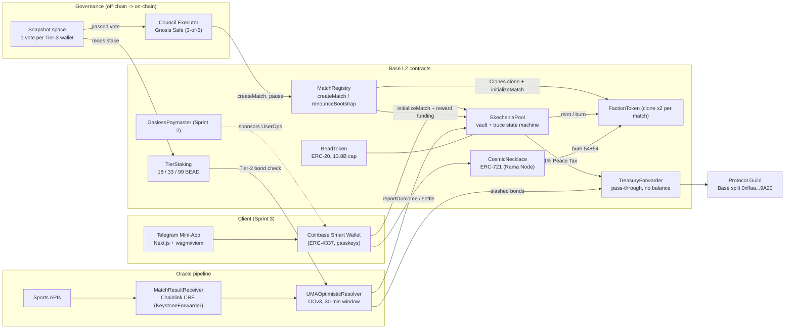
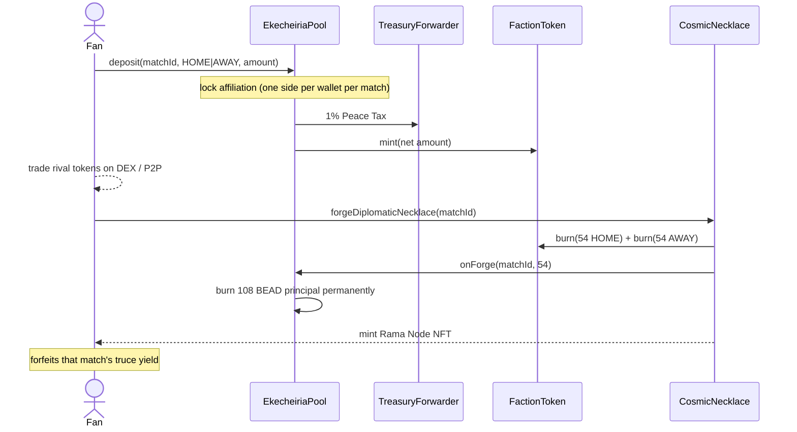
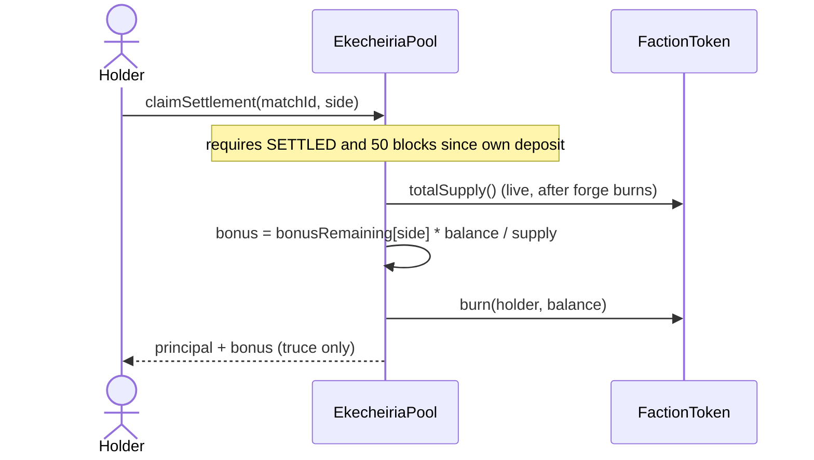
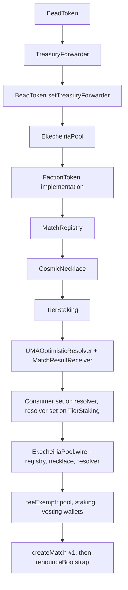

# Necklace Chain ($BEAD) - V1 Architecture (Base, chain ID 8453)

Source of truth: the locked plan (Resolutions 1-17). This diagram covers the V1 "Guarded Mainnet Pilot".

## 1. System context



## 2. Match lifecycle (EkecheiriaPool state machine)

```mermaid
stateDiagram-v2
    [*] --> OPEN: initializeMatch (registry only)
    OPEN --> LOCKED: kickoff / lockMatch
    LOCKED --> PENDING_RESOLUTION: oracle reports provisional score
    PENDING_RESOLUTION --> DISPUTED: Tier-2 challenge (33 BEAD bond)
    DISPUTED --> SETTLED: UMA resolves (bond slashed to forwarder if frivolous)
    PENDING_RESOLUTION --> SETTLED: 30 min elapse, no dispute
    OPEN --> REFUNDED: cancelled / postponed
    LOCKED --> REFUNDED: cancelled / 48h oracle silence
    SETTLED --> [*]: claimSettlement (truce: principal + reward; else 1:1)
    REFUNDED --> [*]: claimRefund (1:1)
```



## 3. Deposit -> forge flow



## 3b. Claim flow and live-supply bonus



## 3c. Gasless transaction flow (Sprint 2)

```mermaid
sequenceDiagram
    actor Fan
    participant TMA as Telegram Mini-App
    participant Bundler
    participant EP as EntryPoint v0.6
    participant PM as GaslessPaymaster
    participant Wallet as Coinbase Smart Wallet
    participant Pool as EkecheiriaPool

    Fan->>TMA: Stake 50 Beads
    TMA->>Bundler: UserOperation (paymasterAndData = PM)
    Bundler->>EP: handleOps
    EP->>PM: validatePaymasterUserOp
    Note over PM: checks factory, (target, selector) allowlist,<br/>per-op cap, sender and global daily budgets
    EP->>Wallet: execute / executeBatch (approve + deposit)
    Wallet->>Pool: deposit(matchId, side, amount)
    EP->>PM: postOp (refund unused budget)
    Note over PM,EP: Gas deposit (depositTo) pays for UserOps;<br/>separate locked stake (addStake) lets validation read PM storage
```

## 4. Staking tiers and governance scope

| Tier | Stake | Name | V1 role |
|------|-------|------|---------|
| 1 | 18 BEAD | The Chai | Basic participation / polls |
| 2 | 33 BEAD | The Chotki | Post dispute bond to challenge oracle result (slashed if frivolous) |
| 3 | 99 BEAD (99 seats) | The Master Council | Match whitelisting, dispute escalation, circuit breaker. No treasury control |

## 5. Deploy order (breaks the circular dependencies)



1. `BeadToken`, `TreasuryForwarder` (Protocol Guild Base split as constructor arg), then `setTreasuryForwarder` (once)
2. `EkecheiriaPool`, `FactionToken` implementation, `MatchRegistry`, `CosmicNecklace`, `TierStaking`
3. Oracle contracts (`UMAOptimisticResolver`, `MatchResultReceiver` with the CRE forwarder address), `setConsumer`, `TierStaking.setResolver`
4. `EkecheiriaPool.wire(registry, necklace, resolver)` (once)
5. Fee-exempt list, fund the resolver with bond currency, Paymaster gas float (Sprint 2)

## 5b. Oracle result codes and genesis vesting

Chainlink Functions was sunset, so results come from a Chainlink Runtime Environment (CRE) workflow in `cre/resolve-match`:

1. The receiver owner or the `requester` keeper calls `MatchResultReceiver.requestMatchResult(matchId, fixtureId)`, which emits `MatchResolutionRequested`.
2. The workflow's EVM log trigger fires (finalized confidence). Each node reads API-Football `/fixtures?id=`; the DON must agree on the outcome code.
3. The workflow signs a report `(uint64 chainSelector, uint256 requestId, uint256 matchId, uint8 outcome)` and the KeystoneForwarder calls `MatchResultReceiver.onReport`.
4. The receiver checks forwarder, chain selector, workflow id/author (once set) and the open request, then calls `UMAOptimisticResolver.proposeOutcome`.

The workflow (`cre/resolve-match/outcome.ts`) returns one `uint8`:

| Code | Meaning | API-Football statuses |
|------|---------|-----------------------|
| 1 | Home win | `FT`, `AET`, `PEN` with `teams.home.winner = true` |
| 2 | Away win | `FT`, `AET`, `PEN` with `teams.away.winner = true` |
| 3 | Draw | `FT` with no winner flag |
| 4 | Cancelled (refund) | `PST`, `CANC`, `ABD`, `AWD`, `WO` |
| error | Not final yet, nothing reported | `NS`, `1H`, `HT`, `2H`, `ET`, `BT`, `P`, `SUSP`, `INT`, `LIVE`, `TBD` |

Every result, including a cancellation, goes receiver -> resolver -> UMA assertion -> 30 minute window before the pool settles or refunds.

Receiver hardening: the KeystoneForwarder is shared by every CRE workflow, so after the real workflow is deployed the owner calls
`setExpectedWorkflowId`, `setExpectedAuthor` and then the one-way `requireWorkflowIdentity()`; from then on `onReport` reverts unless both are set
(`IdentityNotConfigured`). Never enable it while the simulation MockForwarder is configured (it supplies no workflow metadata).

Local verification without any CRE account: `cre/resolve-match/mock` (mock API-Football and a mock DON relay) plus `contracts/script/rehearse-fork-cre.ps1`
on an anvil fork of Base Sepolia, which runs request -> report -> real UMA OOv3 assertion -> settlement -> claims.

Team (cliff 1 year) and private-seed (cliff 6 months) allocations are minted straight into `BeadVestingWallet` contracts when `TEAM_BENEFICIARY` / `SEED_BENEFICIARY` are set at deploy time. Total vesting durations are configurable and still need confirming.

## 6. Locked V1 constraints

- Hard cap 13.8B BEAD; dust threshold 100 whole tokens; 1% Peace Tax; gamma >= 0.30 symmetry; 50-block deposit hold; 30-min challenge window; 48h oracle-silence refund.
- Pool TVL cap is a fixed BEAD amount set at match initialization.
- No monetary yield on the NFT; tenure gives voting weight (1x-6x), up to 30% fee rebate, cosmetic rank.
- Out of V1: PoST nodes, Space Engine, NFC hardware, ZK healthtech, LiquidityLocker (Phase 4).
